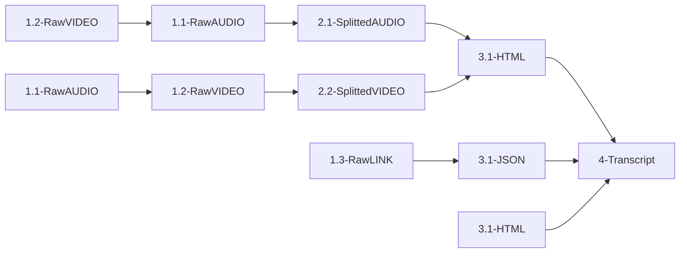

# MediaTranscriber

A Python tool for extracting transcripts from video and audio files.

## Features

- Extracts text and transcripts from video and audio sources.
- Downloads and converts transcripts from SharePoint/Stream links.
- Automatically creates a structured directory for processing media and storing results.
- Includes utilities for data processing.
- Supports web scraping for gathering transcripts from online sources.
- Can be built as a standalone executable using the provided Makefile.
- On first run, the bundled executable automatically generates all necessary folders.

## Repository Structure

- `main.py`: Main entry point for running extraction scripts.
- `DataProcessing/`: Scripts and tools for processing extracted data.
- `WebScraper/`: Tools for scraping transcripts from the web.
- `Utility/`: Additional helper scripts.
- `requirement.txt`: List of Python dependencies.
- `Makefile`: Automates build, run, clean, install, and package operations.

## Supported Input Formats

- **Video:** `.mp4`, `.mov`, `.3gp`, `.avi`, `.mkv`  
- **Audio:** `.mp3`, `.wav`, `.m4a`


## General Pipeline Guide

The system supports **four distinct pipelines** for transcript generation.  
On the first run, the bundled executable automatically creates all necessary folders so you can drop your files into the right place.



### 1. Audio-Based Pipeline (Default)

This is the standard workflow when starting from audio or video files:

1. **Video Conversion**: Place raw video files in `1.2-RawVIDEO/`.  
   → Audio is automatically extracted into `1.1-RawAUDIO/`.

2. **Audio Input**: You can also place audio files directly in `1.1-RawAUDIO/`; they will be processed similarly to the converted ones.

3. **Audio Splitting**: Files in `1.1-RawAUDIO/` are split into segments and stored in `2.1-SplittedAUDIO/`.  
   Each group of splitted files is accompanied by a metadata file that contains information like the language of the audio.

4. **Audio Enhancement (optional)**: Enhanced audio (noise reduction, etc.) is stored in `EXTRA-EnhancedAUDIO/`.

5. **Web Scraping & Conversion**: Splitted audio files from `2.1-SplittedAUDIO/` are processed into HTML outputs in `3-HTML/`.

6. **Transcript Generation**: HTML files are converted into transcripts and saved in `4-Transcript/`.


---

### 2. Video-Based Pipeline (Alternate)

This alternate workflow starts from audio and goes through a video stage:

1. **Audio Input**: Place audio files in `1.1-RawAUDIO/`.

2. **Audio-to-Video Conversion**: Audio files are converted into video format and stored in `1.2-RawVIDEO/`.

3. **Video Splitting**: Files in `1.2-RawVIDEO/` are split into segments and stored in `2.2-SplittedVIDEO/`.  
   Each group of splitted files is accompanied by a metadata file that contains information like the language of the video content.

4. **Web Scraping & Conversion**: Splitted video files from `2.2-SplittedVIDEO/` are processed into HTML outputs in `3-HTML/`.

5. **Transcript Generation**: HTML files are converted into transcripts and saved in `4-Transcript/`.


---

### 3. SharePoint Pipeline

This pipeline downloads and converts transcripts directly from SharePoint/Stream links:

1. **Link Input**: Prepare a JSON file with SharePoint/Stream links in `1.3-RawLINK/`.  
   The JSON can be in one of these formats:
   ```json
   {
     "Video Name 1": "https://...",
     "Video Name 2": "https://..."
   }
   ```
   or
   ```json
   [
     {"name": "Video Name 1", "url": "https://..."},
     {"name": "Video Name 2", "url": "https://..."}
   ]
   ```
   or
   ```json
   [["Video Name 1", "https://..."], ["Video Name 2", "https://..."]]
   ```

2. **SharePoint Transcript Download**: The system opens each link in a browser, extracts the transcript using Selenium, and saves the structured data as JSON in `3.1-JSON/`.

3. **Login Handling**: If you're not already logged in, the system will wait for you to log in to SharePoint/Stream (default timeout: 600 seconds).

4. **Transcript Conversion**: JSON transcript files are converted into concatenated markdown transcripts and saved in `4-Transcript/`.


---

### 4. HTML-to-Transcript Pipeline

This lightweight pipeline skips all media processing and goes directly from HTML files to transcripts:

1. **HTML Input**: Place pre-processed HTML files in `3.1-HTML/`.  
   (These might come from a previous run, external sources, or manual uploads.)

2. **Transcript Generation**: HTML files are parsed and converted into transcripts, which are saved in `4-Transcript/`.

This is useful when you already have HTML files and just need to extract and format the transcript text.


---

## Installation

### 1. Clone the repository
```bash
git clone https://github.com/VitoBarra/TextExtractorFromMedia.git
cd TextExtractorFromMedia
```
### 2. Install Python dependencies
```bash
pip install -r requirements.txt
```


### 3. (Optional) Build the standalone executable

The included Makefile can create a standalone executable for your OS with the help of the makefile 

| Target    | Description                                      | Notes                                                                 |
|-----------|--------------------------------------------------|----------------------------------------------------------------------|
| `all`     | Default target; builds the executable.          | Equivalent to `make build`.                                          |
| `check`   | Checks if PyInstaller is installed.             | Exits with an error if PyInstaller is missing.                       |
| `build`   | Builds the standalone executable.               | Skips if the executable already exists. Adds `--strip` and `--noconsole` in release mode. |
| `run`     | Runs the executable (or builds it first if missing). | Uses the OS-specific executable (`MediaTranscriber.exe` on Windows, `MediaTranscriber` on Linux/macOS). |
| `clean`   | Removes only the executable.                    | Does not delete build folders or spec files.                         |
| `install` | Copies the executable to `/usr/local/bin`.      | Requires `sudo`.                                                     |
| `package` | Creates a tar.gz archive containing the executable. | Uses the `dist` folder and names the archive as `MediaTranscriber-<VERSION>.tar.gz`. |
